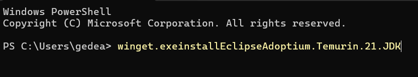
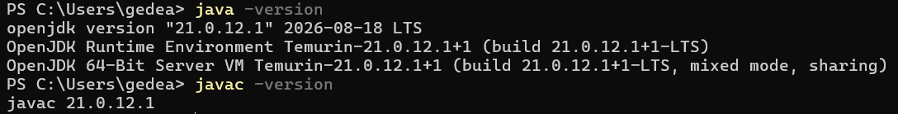
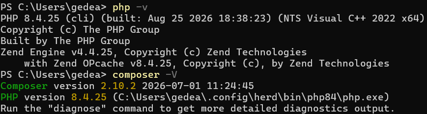
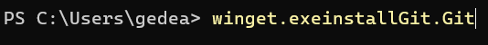
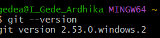
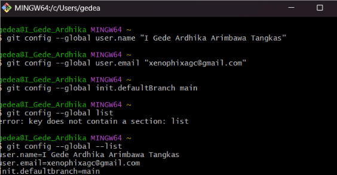

# LAPORAN PRAKTIKUM PEMROGRAMAN BERBASIS OBJEK

| Informasi Praktikan | Keterangan |
| :--- | :--- |
| **Nama** | I Gede Ardhika Arimbawa tangkas |
| **NPM** | 4525210080 |
| **Kelas** | A |
| **Mata Kuliah** | Pemrograman Berbasis Objek (PBO) |
| **Pertemuan** | 1 - Persiapan Praktikum |
| **Tanggal** | 3 September 2026 |

---

## 1. Persiapan Java

### 1.1 download jdk

### 1.2 Check Versi java/jdk

---

## 2. Persiapan PHP

### 2.1 Instalasi Herd

### 2.2 Check Versi PHP

---

## 3.Persiapan Git

### 3.1 Download Git

### 3.2 Check Versi Git

### 3.3 Config Git

---

