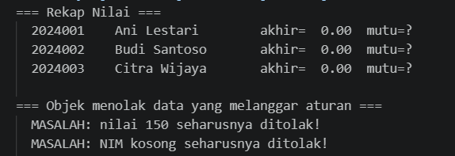
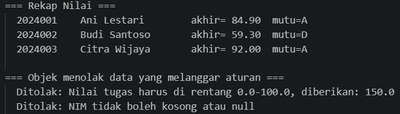
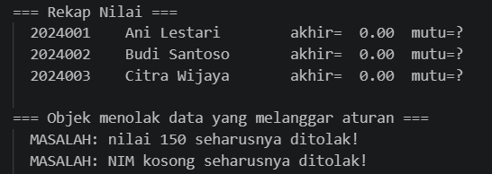
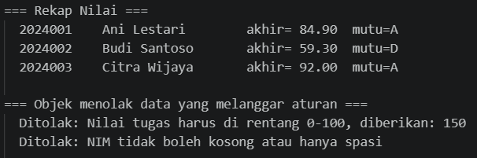

# LAPORAN PRAKTIKUM PEMROGRAMAN BERBASIS OBJEK

| Informasi Praktikan | Keterangan |
| :--- | :--- |
| **Nama** | I Gede Ardhika Arimbawa tangkas |
| **NPM** | 4525210080 |
| **Kelas** | A |
| **Mata Kuliah** | Pemrograman Berbasis Objek (PBO) |
| **Pertemuan** | 2 - kelas-objek-dan-enkapsulasi |
| **Tanggal** | 10 September 2026 |

---

# 1. Implementasi Materi

## 1.1 Mahasiswa.java
**Penjelasan Kode:**
> [File java ini berisi dengan enkapsulasi mahasiswa yang akan digunakan main.java]

**Sebelum:**
> [Arahan: Mempertahankan NIM, menolak NIM kosong atau NULL, Tolak nilai diluar 0-100, membuat method untuk memvalidasi satu komponen nilai, Menghitung nilai akhir, mengembalikan huruf mutu berdasarkan nilai akhir, dan menyediakan getter untuk nim, nama, dan nilaiAkhir.]

**Hasil Run Codingannya Sebelum:**

**Sesudah:**
> [NIM dipertahankan,NIM kosong atau NULL, ditolak, nilai diluar 0-100 ditolak, adanya method untuk memvalidasi satu komponen nilai, nilai akhir terhitung , huruf mutu berdasarkan nilai akhir dikembalikan, dan getter untuk nim, nama, dan nilaiAkhir tersedia.]

**Hasil Run Codingannya Sesudah:**

---

## 1.2 Mahasiswa.php

**Penjelasan Kode:**
> [File php ini berisi dengan enkapsulasi mahasiswa yang akan digunakan main.php]

**Sebelum:**
> [Arahan: Lengkapi daftar parameter, menolak NIM yang kosong, menolak setiap komponen nilai di luar rentang 0-100, melengkapi validasi satu komponen nilai, menghitung nilai akhir, mengembalikan huruf mutu, dan menyediakan getter seperlunya.]

**Hasil Run Codingannya Sebelum:**

**Sesudah:**
> [Daftar parameter lengkap, NIM kosong ditolak, komponen nilai diluar rentang 0-100 ditolak, validasi satu komponen nilai lengkap, nilai akhir terhitung, huruf mutu dikembalikan, dan getter tersedia.]

**Hasil Run Codingannya Sesudah:**

---

# 2. Kesimpulan

> [Setelah codingan java dan php dibenarkan sesuai komentar TODO yang tertera, file jalan lancar sesuai kegunaan seharusnya.]