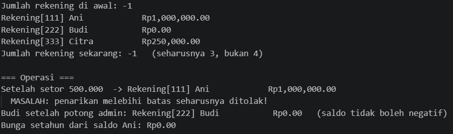
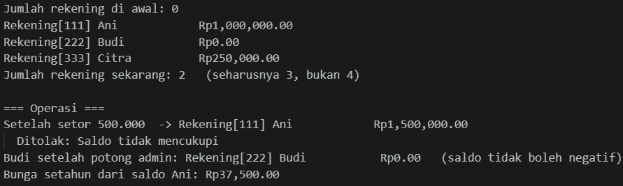
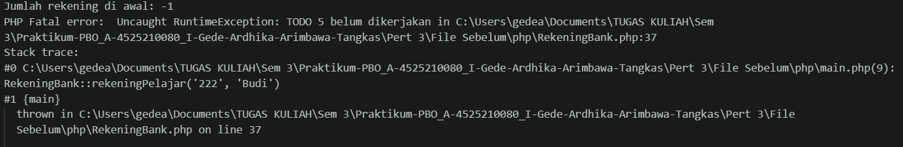
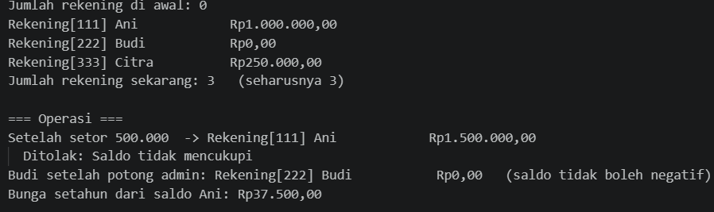

# LAPORAN PRAKTIKUM PEMROGRAMAN BERBASIS OBJEK

| Informasi Praktikan | Keterangan |
| :--- | :--- |
| **Nama** | I Gede Ardhika Arimbawa tangkas |
| **NPM** | 4525210080 |
| **Kelas** | A |
| **Mata Kuliah** | Pemrograman Berbasis Objek (PBO) |
| **Pertemuan** | 3 - constructor-anggota-statis-dan-konstanta |
| **Tanggal** | 10 September 2026 |

---

# 1. Implementasi Materi

## 1.1 RekeningBank.java
**Penjelasan Kode:**
> [File java ini berisi dengan perhitungan dan persyaratan yang akan dipanggil main.java]

**Sebelum:**
> [Arahan: mengganti bunga, biaya, dan batas menjadi konstanta, mendeklarasikan field statis penghitung jumlah rekening, mendelegasikan ke constructor lengkap dengan this(...), menolak nomor kosong dan saldo awal negatif, menaikkan penghitung jumlah rekening pada satu tempat khusus, menolak jumlah <= 0, lalu tambahkan ke saldo, menolak jumlah <= 0, tolak jika melebihi saldo, kurangi saldo sebesar biaya administrasi, tanpa sampai negatif, mengembalikan jumlah rekening yang pernah dibuat, menghitung bunga setahun dari pokok.]

**Hasil Run Codingannya Sebelum:**

**Sesudah:**
> [Konstanta sudah diganti, field statis sudah di deklarasikan, constructor sudah didelegasikan, nomor kosong dan saldo awal negatif ditolak,penghitung jumlah rekening pada satu tempat khusus dinaikkan, jumlah <= 0 ditolak dan saldo ditambahkan, jumlah <= 0 ditolak dan melebihi saldo ditolak, saldo sudah dikurangi sebesar biaya administrasi tanpa sampai negatif, jumlah rekening yang sudah dibuat dikembalikan, dan bunga setahun dari pokok dihitung ]

**Hasil Run Codingannya Sesudah:**

## 1.2 RekeningBank.php
**Penjelasan Kode:**
> [File php ini berisi dengan perhitungan dan persyaratan yang akan dipanggil main.php]

**Sebelum:**
> [Arahan: mengganti bunga, biaya, dan batas menjadi konstanta, mendeklarasikan field statis penghitung jumlah rekening, menolak nomor kosong dan saldo awal negatif, menaikkan penghitung jumlah rekening pada satu tempat khusus, membuat constructor baru menggunakan `new static()`, menolak <= 0, tolak melebihi saldo dan menolak melebihi batas sekali tarik, jumlah rekening yang sudah dibuat dikembalikan, dan bunga setahun dari pokok dihitung]

**Hasil Run Codingannya Sebelum:**

**Sesudah:**
> [Konstanta sudah diganti, field statis sudah di deklarasikan, nomor kosong dan saldo awal negatif ditolak,penghitung jumlah rekening pada satu tempat khusus dinaikkan, constructor baru menggunakan `new static()` dibuat ,jumlah <= 0 ditolak dan melebihi sekali tari ditolak, jumlah rekening yang sudah dibuat dikembalikan, dan bunga setahun dari pokok dihitung ]

**Hasil Run Codingannya Sesudah:**

---

# 2. Kesimpulan

> [Pembuatan construktor baru pada php menggunakan `new static()`, BUKAN `new self()`, php menampilkan 3 rekening sedangkan java menampilkan 2 bukan 3. Setelah codingan java dan php dibenarkan sesuai komentar TODO yang tertera, file jalan lancar sesuai kegunaan seharusnya. ]