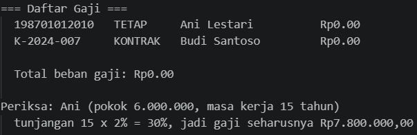
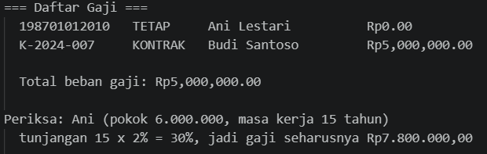
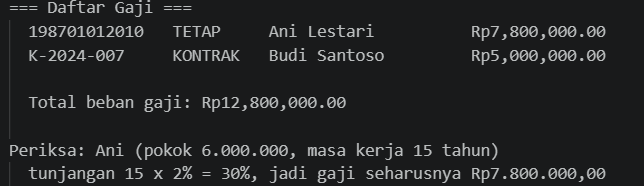
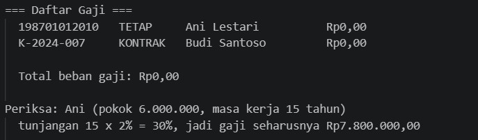
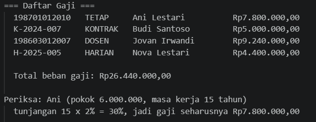

# LAPORAN PRAKTIKUM PEMROGRAMAN BERBASIS OBJEK

| Informasi Praktikan | Keterangan |
| :--- | :--- |
| **Nama** | I Gede Ardhika Arimbawa tangkas |
| **NPM** | 4525210080 |
| **Kelas** | A |
| **Mata Kuliah** | Pemrograman Berbasis Objek (PBO) |
| **Pertemuan** | 4 - Inheretence |
| **Tanggal** | 17 September 2026 |

---

# 1. Implementasi Materi

## 1.1 Pegawai.java
**Penjelasan Kode:**
> [File java ini berisi dengan perilaku dan persyaratan yang akan dipanggil main.java dan merupakan parent untuk PegawaiKontrak.java dan PegawaiTetap.java]

**Sebelum:**
> [Arahan: Menolak gaji pokok negatif, mengembalikan gaji pokok apa adanya sebagai perilaku dasar.]

**Hasil Run Codingannya Sebelum:**

**Sesudah:**
> [Gaji pokok negatif ditolak, gaji pokok dikembalikan apadanya sebagai perilaku dasar]

**Hasil Run Codingannya Sesudah:**

## 1.2 PegawaiKontrak.java
**Penjelasan Kode:**
> [File java ini merupakan child class/extension Pegawai.java yang berfungsi untuk menampilkan informasi untuk pegawai kontrak]

**Sebelum:**
> [Arahan: pegawai kontrak TIDAK mendapat tunjangan masa kerja.]

**Hasil Run Codingannya Sebelum:**

**Sesudah:**
> [Pegawai kontrak TIDAK mendapat tunjangan masa kerja.]

**Hasil Run Codingannya Sesudah:**

## 1.3 PegawaiTetap.java
**Penjelasan Kode:**
> [File java ini merupakan child class/extension Pegawai.java yang berfungsi untuk menampilkan informasi untuk pegawai tetap]

**Sebelum:**
> [Arahan: menambahkan perhitungan gaji]

**Hasil Run Codingannya Sebelum:**

**Sesudah:**
> [Perhitungan gaji sudah ditambahkan.]

**Hasil Run Codingannya Sesudah:**

## 1.4 Pegawai.php
**Penjelasan Kode:**
> [File php ini berisi dengan class pegawai, pegawai tetap, dan pegawai kontrak yang akan dipanggil main.php.]

**Sebelum:**
> [Arahan: menolak gaji pokok negatif, mengembalikan gaji pokok apa adanya, menambahkan gaji dasar induk dan tunjangan masa kerja, membuat class dosen sebagai turunan pegawai tetap, dan menambahkan class pegawai harian.]

**Hasil Run Codingannya Sebelum:**

**Sesudah:**
> [Gaji pokok negatif ditolak, gaji pokok dikembalikan apa adanya, gaji dasar induk dan tunjangan masa kerja ditambahkan, class dosen dibuat, dan class pegawai harian ditambahkan.]

**Hasil Run Codingannya Sesudah:**

---

# 2. Kesimpulan

> [class pegawai merupakan class induk untuk class lainnya melalui inheretence (class pegawai(nama anak class) extends Pegawai)]