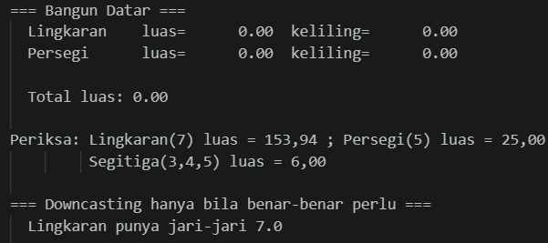
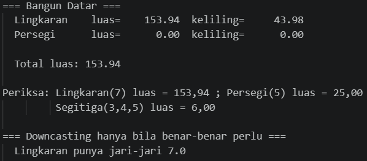
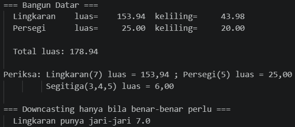
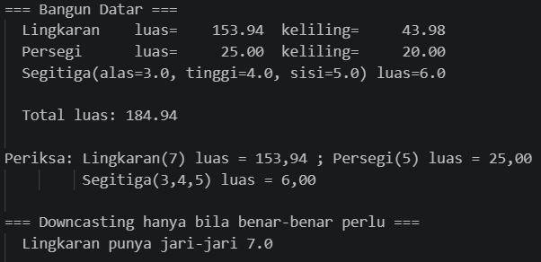
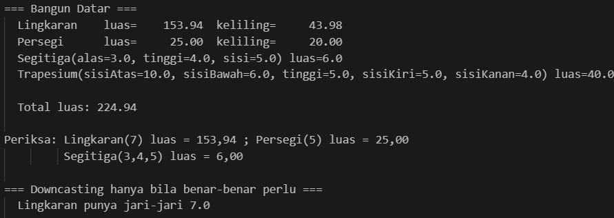
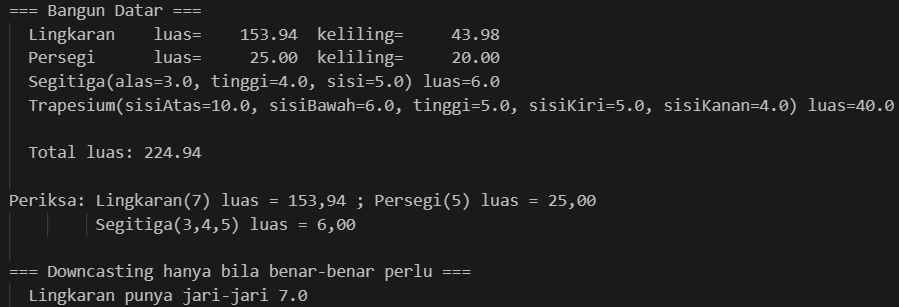
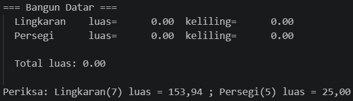
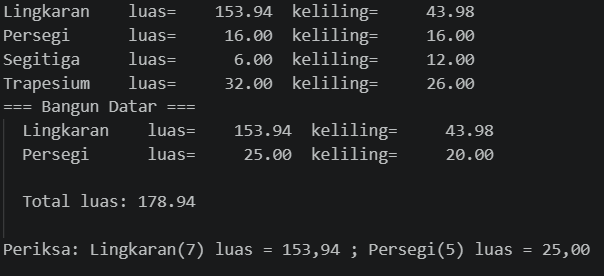
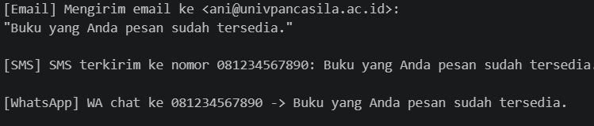

# LAPORAN PRAKTIKUM PEMROGRAMAN BERBASIS OBJEK

| Informasi Praktikan | Keterangan |
| :--- | :--- |
| **Nama** | I Gede Ardhika Arimbawa tangkas |
| **NPM** | 4525210080 |
| **Kelas** | A |
| **Mata Kuliah** | Pemrograman Berbasis Objek (PBO) |
| **Pertemuan** | 5 - Polimorfisme |
| **Tanggal** | 24 September 2026 |

---

# 1. Implementasi Materi

## 1.1 Java

### 1.1.1 BangunDatar.java
**Penjelasan Kode:**
> [File java ini berisi dengan perilaku dan persyaratan yang akan dipanggil main.java dan merupakan parent untuk Lingkaran.java, Persegi.java, Segitiga.java dan Trapesium.java]

**Sebelum:**
> [Tidak ada arahan]

**Hasil Run Codingannya Sebelum:**

**Sesudah:**
> [Tidak ada arahan]

**Hasil Run Codingannya Sesudah:**

### 1.1.2 Lingkaran.java
**Penjelasan Kode:**
> [File java ini berisi dengan perilaku dan persyaratan extention class lingkaran]

**Sebelum:**
> [Menolak jari-jari <= 0, dan melengkapi luas() dan keliling().]

**Hasil Run Codingannya Sebelum:**

**Sesudah:**
> [Jari-jari <=0 ditolak, dan luas dan keliling sudah lengkap]

**Hasil Run Codingannya Sesudah:**

### 1.1.3 Persegi.java
**Penjelasan Kode:**
> [File java ini berisi dengan perilaku dan persyaratan extention class persegi.]

**Sebelum:**
> [Menolak sisi <= 0, dan melengkapi luas() dan keliling().]

**Hasil Run Codingannya Sebelum:**

**Sesudah:**
> [sisi <=0 ditolak, dan luas dan keliling sudah lengkap]

**Hasil Run Codingannya Sesudah:**

### 1.1.4 Segitiga.java
**Penjelasan Kode:**
> [File java ini berisi dengan perilaku dan persyaratan extention class segitiga.]

**Sebelum:**
> [file ini sebelumnya tidak ada (arahan membuatnya berada pada file Main.java)]

**Hasil Run Codingannya Sebelum:**

**Sesudah:**
> [File sudah ada]

**Hasil Run Codingannya Sesudah:**

### 1.1.5 Trapesium.java
**Penjelasan Kode:**
> [File java ini berisi dengan perilaku dan persyaratan extention class trapesium.]

**Sebelum:**
> [file ini sebelumnya tidak ada (arahan membuatnya berada pada file Main.java)]

**Hasil Run Codingannya Sebelum:**

**Sesudah:**
> [File sudah ada]

**Hasil Run Codingannya Sesudah:**

### 1.1.6 AntiPattern.java
**Penjelasan Kode:**
> [File java ini berisi dengan method perhitungan untuk segitiga, persegi, dan lingkaran tanpa polimorfisme.]

**Sebelum:**
> [tidak ada arahan (arahan adalah untuk membuat file AntiPatternRefaktor yang memiliki polimorfisme)]

**Hasil Run Codingannya Sebelum:**

**Sesudah:**
> [tidak ada arahan (arahan adalah untuk membuat file AntiPatternRefaktor yang memiliki polimorfisme)]

**Hasil Run Codingannya Sesudah:**

### 1.1.7 AntiPatternRefaktor.java
**Penjelasan Kode:**
> [File java ini berisi dengan method perhitungan untuk segitiga, persegi, dan lingkaran dengan polimorfisme.]

**Sebelum:**
> [arahan: membuat file ini.]

**Hasil Run Codingannya Sebelum:**

**Sesudah:**
> [File sudah terbuat.]

**Hasil Run Codingannya Sesudah:**

### 1.1.8 Main.java
**Penjelasan Kode:**
> [File java ini berisi dengan method pemanggilan untuk child class BangunDatar.java.]

**Sebelum:**
> [arahan: menambahkan new Segitiga(3, 4, 5), dan new Trapesium(10, 6, 5, 5, 4).]

**Hasil Run Codingannya Sebelum:**

**Sesudah:**
> [new Segitiga(3, 4, 5), dan new Trapesium(10, 6, 5, 5, 4) sudah ditambahkan.]

**Hasil Run Codingannya Sesudah:**

---

## 1.2 PHP

### 1.2.1 BangunDatar.php
**Penjelasan Kode:**
> [File php ini berisi dengan perilaku dan persyaratan bangun datar yang akan dipanggil main.php.]

**Sebelum:**
> [Arahan: menolak jari-jari <= 0, menggunakan M_PI, bukan 3.14, menolak sisi <= 0, membuat class segitiga, dan trapesium.]

**Hasil Run Codingannya Sebelum:**

**Sesudah:**
> [jari-jari <= 0 ditolak , menggunakan M_PI, sisi <= 0 ditolak, class segitiga dan trapesium sudah terbuat.]

**Hasil Run Codingannya Sesudah:**

### 1.2.2 notifikasi.php
**Penjelasan Kode:**
> [File php ini berisi dengan perilaku dan persyaratan notifikasi yang akan dipanggil oleh file ini sendiri.]

**Sebelum:**
> [Arahan: membuat kelas abstrak Notifikasi, membuat tiga turunan, mengirim pesan ke seluruh notifikasi dalam daftar.]

**Hasil Run Codingannya Sebelum:**
> [tidak keluar apa apa]

**Sesudah:**
> [kelas abstrak Notifikasi terbuat, tiga turunan terbuat, pesan ke seluruh notifikasi dalam daftar terkirim.]

**Hasil Run Codingannya Sesudah:**

---

# 2. Kesimpulan

> [polimorfisme adalah prinsip di mana satu antarmuka atau nama metode yang sama dapat digunakan untuk menjalankan perilaku yang berbeda.File java dan php mencetak hasil perhitungan bangun datar dan notifikasi untuk php.]