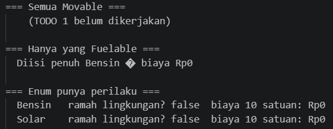
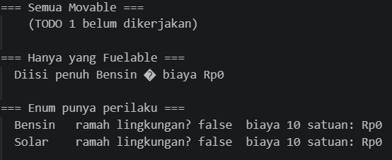
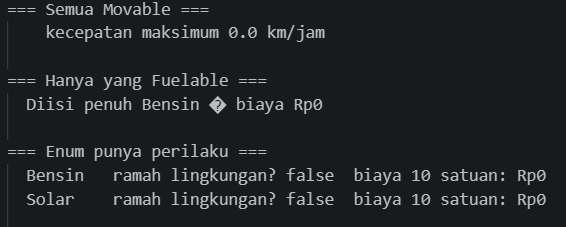
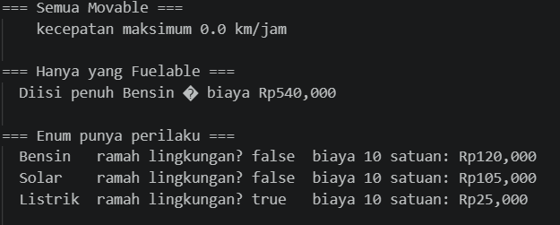
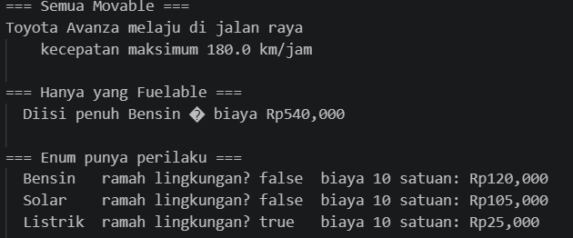
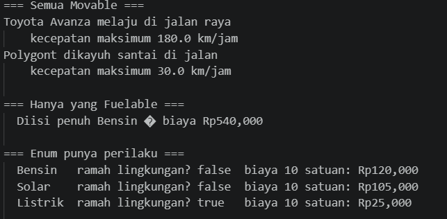
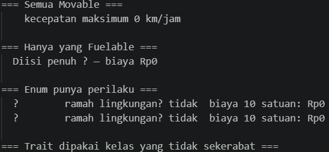
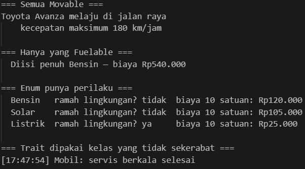
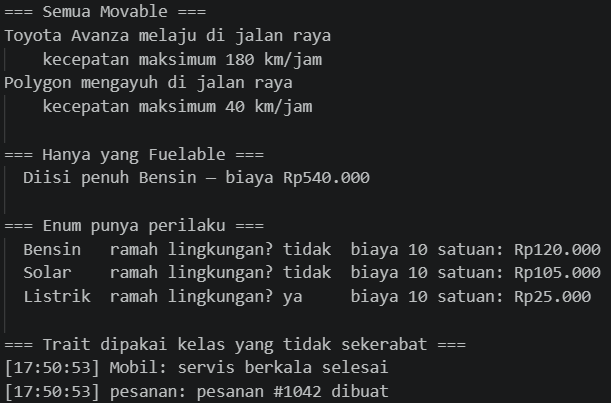

# LAPORAN PRAKTIKUM PEMROGRAMAN BERBASIS OBJEK

| Informasi Praktikan | Keterangan |
| :--- | :--- |
| **Nama** | I Gede Ardhika Arimbawa tangkas |
| **NPM** | 4525210080 |
| **Kelas** | A |
| **Mata Kuliah** | Pemrograman Berbasis Objek (PBO) |
| **Pertemuan** | 6 - Abstract Class, Interface, Enum, dan Trait |
| **Tanggal** | 8 Oktober 2026 |

---

# 1. Implementasi Materi

## 1.1 Java

### 1.1.1 Kendaraan.java
**Penjelasan Kode:**
> [File java ini berisi dengan perilaku dan persyaratan yang akan dipanggil extention class]

**Sebelum:**
> [arahan: mengembalikan umur kendaraan.]

**Hasil Run Codingannya Sebelum:**

**Sesudah:**
> [Umur kendaraan dikembalikan.]

**Hasil Run Codingannya Sesudah:**

### 1.1.2 Movable.java
**Penjelasan Kode:**
> [File java ini berisi dengan perilaku dan persyaratan yang akan dipanggil Main.java yaitu mengembalikan ringkasan kecepatan.]

**Sebelum:**
> [arahan: mengembalikan ringkasan kecepatan.]

**Hasil Run Codingannya Sebelum:**

**Sesudah:**
> [Ringkasan kecepatan dikembalikan.]

**Hasil Run Codingannya Sesudah:**

### 1.1.3 TipeBahanBakar.java
**Penjelasan Kode:**
> [File java ini berisi dengan perilaku dan persyaratan yang akan dipanggil Main.java yaitu mengembalikan tipe bahan bakar dan harganya.]

**Sebelum:**
> [arahan: melengkapi konstanta enum, tambahkan LISTRIK, mencetak biaya pengisian, mengembalikan ramah lingkugan untuk listrik.]

**Hasil Run Codingannya Sebelum:**

**Sesudah:**
> [konstanta enum lengkap, LISTRIK sudah ditambahkan, biaya pengisian tercetak, ramah lingkugan untuk listrik dikembalikan.]

**Hasil Run Codingannya Sesudah:**

### 1.1.4 Mobil.java
**Penjelasan Kode:**
> [File java ini berisi dengan perilaku dan persyaratan yang akan dipanggil Main.java yaitu mengembalikan informasi mobil.]

**Sebelum:**
> [arahan: melengkapi kontrak Movable, melengkapi kontrak Fuelable.]

**Hasil Run Codingannya Sebelum:**

**Sesudah:**
> [kontrak Movable lengkap, kontrak Fuelable lengkap.]

**Hasil Run Codingannya Sesudah:**

### 1.1.5 Sepeda.java
**Penjelasan Kode:**
> [File java ini berisi dengan perilaku dan persyaratan yang akan dipanggil Main.java yaitu mengembalikan informasi sepeda.]

**Sebelum:**
> [arahan: membuat file ini.]

**Hasil Run Codingannya Sebelum:**

**Sesudah:**
> [File sudah ada.]

**Hasil Run Codingannya Sesudah:**

### 1.1.6 Main.java
**Penjelasan Kode:**
> [File java ini akan memanggil file java yang lainnya]

**Sebelum:**
> [arahan: tambahkan Sepeda ke daftar setelah kelasnya dibuat]

**Hasil Run Codingannya Sebelum:**

**Sesudah:**
> [Sepeda sudah ditambahkan ke daftar]

**Hasil Run Codingannya Sesudah:**

---

## 1.2 PHP

### 1.2.1 abstraksi.php
**Penjelasan Kode:**
> [File php ini berisi dengan perilaku dan persyaratan kendaraan yang akan dipanggil main.php.]

**Sebelum:**
> [Arahan: menambahkan case Listrik, mengembalikan label yang enak dibaca, menambahkan Bensin 12000, Solar 10500, Listrik 2500, mencetak biaya pengisian, menambahkan check untuk ramah lingkungan, mencetak baris log berformat, mencetak umur kendaraan, melengkapi kontrak Movable dan Fuelable, membuat class sepeda, membuat class pesanan.]

**Hasil Run Codingannya Sebelum:**

**Sesudah:**
> [case Listrik ditambahkan, label yang enak dibaca dikembalikan , Bensin 12000, Solar 10500, Listrik 2500 ditambahkan, biaya pengisian dicetak, check untuk ramah lingkungan ditambahakan, baris log berformat dicetak, umur kendaraan dicetak, kontrak Movable dan Fuelable sudah dilengkapi, class sepeda dibuat, class pesanan dibuat.]

**Hasil Run Codingannya Sesudah:**

### 1.2.2 main.php
**Penjelasan Kode:**
> [File php ini file utama/pemanggil file lain.]

**Sebelum:**
> [Arahan: menambahkan $sepeda ke daftar, menambahkan new Pesanan()->log('pesanan #1042 dibuat')]

**Hasil Run Codingannya Sebelum:**

**Sesudah:**
> [$sepeda ke daftar ditambahkan, new Pesanan()->log('pesanan #1042 dibuat') ditambahkan]

**Hasil Run Codingannya Sesudah:**

---

# 2. Kesimpulan

> [Abstract class merupakan kelas dasar yang tidak bisa diinstansiasi dan dapat memiliki metode berimplementasi maupun tidak, interface adalah kontrak berisi daftar metode wajib tanpa kode implementasi, enum adalah tipe data khusus penampung daftar nilai konstanta tetap, sedangkan trait berfungsi membagikan kumpulan metode ke berbagai kelas secara fleksibel tanpa terikat hierarki pewarisan. Pada file java mencetak movable, fuelable, dan tipe bahan bakar, sedangkan pada file php mencetak movable, fuelable, tipe bahan bakar, dan pesan dalam bentuk trait]